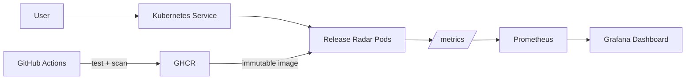

# Release Radar 

[](https://github.com/escarmentb/release-radar/actions/workflows/ci.yml)
[](https://github.com/escarmentb/release-radar/actions/workflows/codeql.yml)

A production-minded DevOps portfolio project: a dependency-free Python service shipped as a hardened container, observed with Prometheus and Grafana, validated in CI, and ready for Kubernetes.

## What this does

- **CI/CD:** tests, immutable image builds, Trivy vulnerability gates, CodeQL, and publishing to GHCR
- **Cloud-native operations:** health probes, resource bounds, autoscaling, disruption budgets, network policy, and Kustomize overlays
- **Observability:** structured JSON logs, Prometheus metrics, and a provisioned Grafana dashboard
- **Container security:** non-root UID, read-only filesystem, dropped capabilities, `no-new-privileges`, and a minimal runtime
- **Reliability:** two replicas, startup/readiness/liveness separation, graceful rolling updates, and controlled scale-down
- **Infrastructure as code:** Terraform-managed immutable AWS ECR repository with encryption, scanning, tags, and retention

## Architecture



## Run it locally

```bash
docker compose up --build -d
curl http://localhost:8080/
```

Open Grafana at `http://localhost:3000` (anonymous viewer enabled) and Prometheus at `http://localhost:9090`. Generate traffic with `curl http://localhost:8080/` a few times to populate the dashboard.

Run the test suite without installing dependencies:

```bash
python -m unittest discover -s tests -v
```

## Deploy to Kubernetes

The manifests publish and deploy images from the `escarmentb` GitHub Container Registry namespace:

```bash
kubectl apply -k k8s/overlays/prod
kubectl -n release-radar port-forward svc/release-radar 8080:80
```

The HPA needs Metrics Server. The network policy needs a CNI that enforces NetworkPolicy.

## CI/CD flow

Every pull request runs tests, builds the exact production image, blocks high/critical vulnerabilities, and renders the production manifests. Merges to `main` publish both the commit SHA (immutable deployment target) and `latest` (convenience only) to GHCR.

## Repository map

| Path | Purpose |
|---|---|
| `app/` | Dependency-free HTTP service and Prometheus metrics |
| `tests/` | API smoke and health tests |
| `observability/` | Prometheus scrape config and provisioned Grafana dashboard |
| `k8s/` | Hardened base resources and production Kustomize overlay |
| `terraform/` | Opt-in AWS ECR infrastructure with safe retention defaults |
| `.github/workflows/` | CI, supply-chain scanning, publishing, and CodeQL |

## Optional AWS infrastructure

The Terraform module creates only an ECR repository; it does not create a paid Kubernetes cluster. Review the plan before applying:

```bash
cd terraform
terraform init
terraform plan
terraform apply
```

AWS credentials and any resulting cloud charges remain your responsibility. Run `terraform destroy` when you no longer need the repository (it refuses deletion while images remain).


## License

MIT — use it, extend it, and make it yours.
